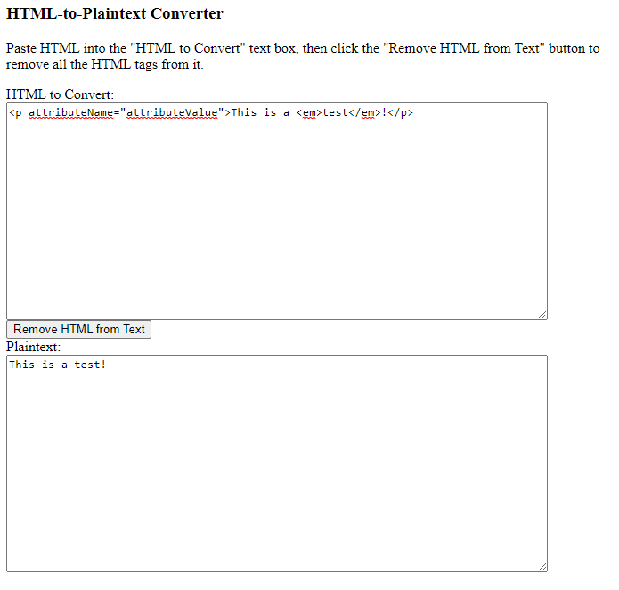

HtmlToPlaintextConverter
========================

The code in this repository, when run, will present a user interface that allows the user to specify an HTML file, and strip the HTML tags from it, leaving only the plain text.

